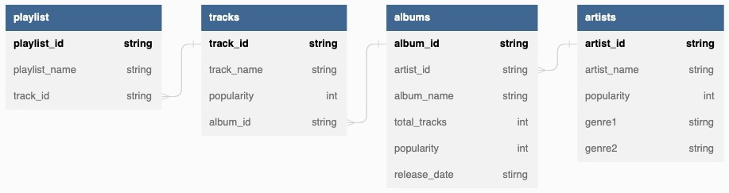
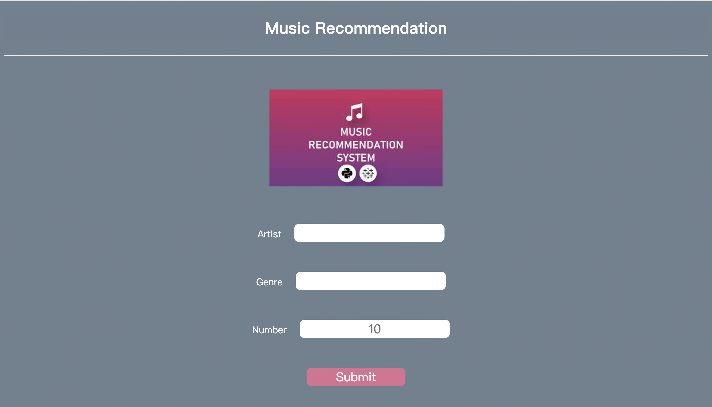
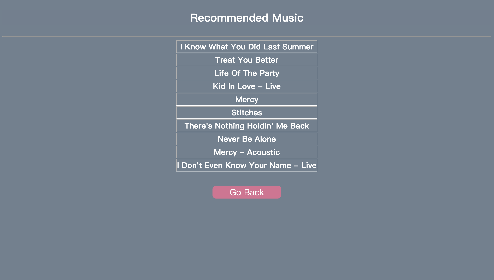

# CPSC 537 Project Report

## Team Member

Ke Wang	            kw754

Weiyi Li                 wl468

Ji Yoon Lee	        jl3699

Weiqiang Zheng  wz347

## Introduction and project goals

With the growing popularity of streaming music platforms such as Pandora, Spotify, Apple music, automatic playlist continuation (APC) has drawn increasing attention in recent years. Music recommendation is a process in which a computer algorithm suggests songs or other pieces of music to a user based on their personal preferences and listening history. This technology has become increasingly important in recent years as more and more people use streaming services to listen to music. By providing personalized recommendations, these services can help users discover new music that they might enjoy, as well as help them find their favorite songs and artists more easily.

In this project, we will use collected online data through Spotify API and AIcrowd competitions to provide musical recommendations for users. We simplify the task by direct ask users to submit their keywords and our application will return a list of songs based on their preferences. The project goals are following: 

1. We collect and clean the data using Python (e.g. package pandas, requests) .
2. We store the data in BigQuery on Google Cloud Platform. The data is well-organized in several tables. 
3. We implement our strategy of recommendation using SQL. 
4. We also build an user-friendly interface for the application. 

## Description of Data

1. The first data source is the [*Spotify Million Playlist Dataset Challenge*][1] dataset, which contains thousands of playlists' information.

2. The second data source we utilize is [Spotify API][2]. We implement a Python class [SpotifyAPI][3] to interact with it. Based on all the tracks' id from the playlists in the first dataset, we retrieve information about related artists, albums, and tracks from Spotify.

   [1]: https://www.aicrowd.com/challenges/spotify-million-playlist-dataset-challenge	"Spotify Million Playlist Dataset Challenge"
   [2]: https://developer.spotify.com/documentation/web-api/	"Spotify API"
   [3]: ../database/spotify_client.py

## Basic architecture

1. Data collection and processing: This part is responsible for manipulating data from the two sources and preprocessing them before populating the tables in database system. The [*Spotify Million Playlist Dataset Challenge*][1] dataset can be directly downloaded in a json format. To retrieve information from Spotify, we initialize the client object and send requests to return corresponding music data. Related codes are in [get_data.ipynb][4].
   
   [4]: ../database/get_data.ipynb

2. Database Schema: We create a dataset called *music_data* in BigQuery on Google Cloud Platform. This dataset includes 4 tables: *playlist*, *tracks*, *albums*, *artists*. After data cleaning, we populate the 4 tables. The schema is shown as below.

   

3. Recommendation function: Implementing a sophisticated recommendation algorithm is beyond the scope of this project, as the main goal is to use the database system in a pratical application. We provide 3 parameters for the user to enter: *Artist*, *Genre* and *Number*. Users can type in the artist name and/or genre they are interested in and decide how many tracks they want to return. The default number of songs is 10. After passing in these arguments, our recommendation function can return the required number of most popular songs in the category defined by *Artist* and *Genre*. If there are no matching songs, the function will return the most popular songs in the union sets.

4. User interface: This part is responsible for presenting the recommendations to users and allowing them to interact with the system. We used [Flask][3] to bulid the user interface. User may submit "Artist", "Genre", "Number" and get a list of recommended songs with the specified number. 

   [3]: https://flask.palletsprojects.com/en/2.2.x/	"Flask"

## Key features of the project and Technical Challenges

1. We implemented a simple yet beautifull user interface on web using **Flask, HTML, and CSS**. This enables users to easily interact with the system. Below are two screenshots of our user interface. The main architecture of the web is implemented in **HTML** (`./templates/input.html` and `./templates/result.html`), with **CSS** (`./static/css/main.css`) to format the layout of webpages. We use **Flask**(`./app.py`) to render the html and interact with the backend. 
   
   

2. In the implementation of our recommendation function, we included two complex SQL queries, each with multiple joins and aggregation. 

   ```sql
   			SELECT tracks.track_name
     			FROM music_data.tracks
               LEFT JOIN music_data.albums
               ON tracks.album_id = albums.album_id
               LEFT JOIN music_data.artists 
               ON albums.artist_id = artists.artist_id
               WHERE artists.artist_name = '{artist}'
               AND (artists.genre1 LIKE '%{genre}%' OR artists.genre2 LIKE '%{genre}%')
               ORDER BY tracks.popularity DESC
               LIMIT {number}
   ```

   ```sql
   			SELECT tracks.track_name
               FROM music_data.tracks
               LEFT JOIN music_data.albums
               ON tracks.album_id = albums.album_id
               LEFT JOIN music_data.artists 
               ON albums.artist_id = artists.artist_id
               WHERE artists.artist_name = '{artist}'
               OR artists.genre1 LIKE '%{genre}%' 
               OR artists.genre2 LIKE '%{genre}%'
               ORDER BY tracks.popularity DESC
               LIMIT {number}
   ```